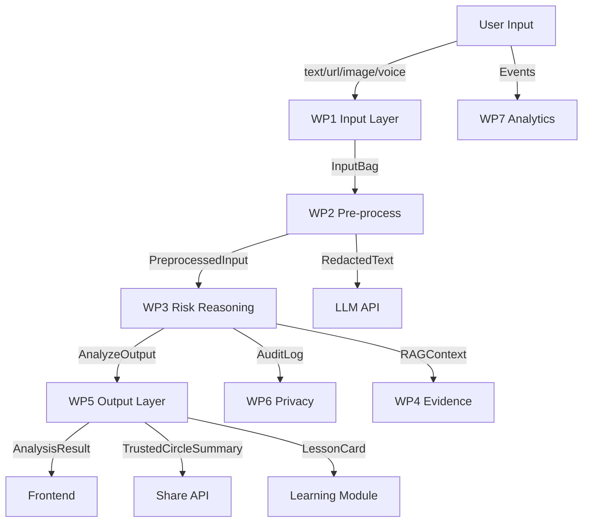
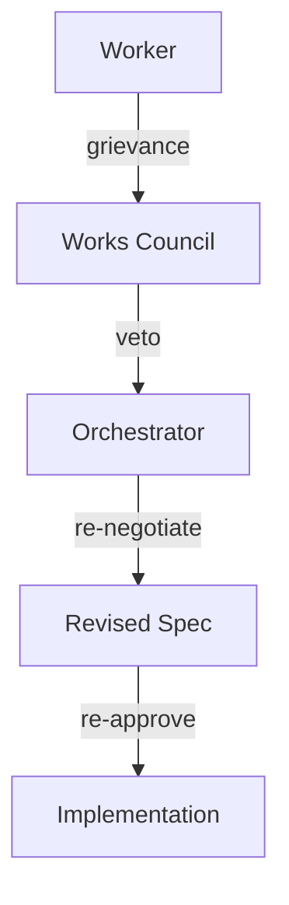
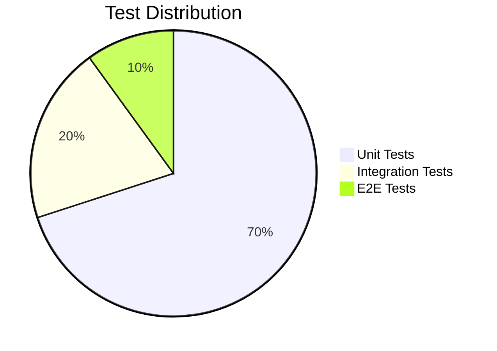

# UNESCO Hackathon Backend Architecture Plan
## Company Architect Methodology

**Strategy Layer** → **Operations Layer** → **Support Layer**

This document defines the complete backend architecture for the SilverTrust MIL Companion using the Company Architect methodology with parallel branch development.

## 1. Strategy Layer (Aufsichtsrat)

### 1.1 Business Objectives
- Build AI-powered decision companion for older adults in Vietnam
- Support 4 input channels: text, URL, image (OCR), voice (STT)
- Provide risk analysis, micro-learning, trusted circle sharing
- Ensure privacy, safety, and compliance for vulnerable users
- Enable UNESCO pilot reporting with analytics

### 1.2 Technical Strategy
- **Parallel Branch Development**: Each work package in independent branch
- **Interface Contracts**: Explicit TypeScript interfaces between layers
- **Pure Functions**: All business logic testable without I/O
- **Privacy-by-Design**: PII redaction before any external call
- **Unix Philosophy**: Do one thing well, composeable modules

### 1.3 Work Package Taxonomy

| WP | Layer | Description | Dependencies |
|----|-------|-------------|--------------|
| WP1 | Input | Unified input ingestion (text/url/image/voice) | None |
| WP2 | Pre-process | Normalization, entity extraction, PII redaction | WP1 |
| WP3 | Risk | Rule-based scoring + LLM explanation + RAG | WP2, WP4 |
| WP4 | Evidence | Curated trusted alerts for RAG | None |
| WP5 | Output | Analysis result + Trusted Circle + Lesson Card | WP3 |
| WP6 | Privacy | Ephemeral sessions, consent, audit log | WP2 |
| WP7 | Analytics | Events, aggregation, UNESCO report export | WP1-WP5 |

### 1.4 Branch Strategy

```mermaid
gitGraph
  commit id: "main"
  branch feat/wp1-input-layer
  branch feat/wp2-preprocess
  branch feat/wp4-evidence
  branch feat/wp7-analytics
  commit id: "WP1 done" tag: "wp1"
  commit id: "WP2 done" tag: "wp2"
  commit id: "WP4 done" tag: "wp4"
  commit id: "WP7 done" tag: "wp7"
  merge feat/wp1-input-layer
  merge feat/wp2-preprocess
  merge feat/wp4-evidence
  merge feat/wp7-analytics
```

## 2. Operations Layer (Vorstand)

### 2.1 Interface Contracts

#### WP1 → WP2 Contract
```typescript
// src/api/input/types.ts
export interface InputBag {
  kind: 'text' | 'url' | 'image' | 'voice';
  text: string; // populated for text/url, empty for image/voice
  url?: string; // populated for url
  imageRef?: string; // opaque ref for WP2 OCR
  voiceRef?: string; // opaque ref for WP2 STT
  mimeType?: string; // for media
  source?: string; // 'paste', 'zalo', 'upload', etc.
  receivedAt: number; // epoch ms
}
```

#### WP2 → WP3 Contract
```typescript
// src/api/preprocess/pipeline.ts
export interface PreprocessedInput {
  original: InputBag; // audit trail
  normalised: NormalisedText; // cleaned, ascii, lower views
  entities: ExtractionResult; // phones, cccd, emails, money, urls
  redacted: RedactResult; // PII-free text for LLM/share
}
```

#### WP3 → WP5 Contract
```typescript
// src/api/risk/contract.ts
export interface AnalyzeOutput {
  riskLevel: 'safe' | 'caution' | 'high_risk' | 'insufficient_data';
  redFlags: RedFlag[]; // urgency, upfront_payment, etc.
  verificationSteps: string[]; // what user should do next
  nextAction: string; // one-line summary
  lessonCard?: LessonCard; // micro-learning content
  disclaimer: string; // no medical/legal/financial advice
}
```

### 2.2 Data Flow



### 2.3 Error Handling Strategy

- **Validation Errors**: Typed `InputValidationError` with codes
- **Processing Errors**: `PreprocessError` with context
- **Risk Errors**: `RiskEngineError` with fallback to template
- **Privacy Errors**: `ConsentRequiredError` before sharing
- **Analytics Errors**: Silent fail (no PII in events)

## 3. Support Layer (Abteilungsleiter)

### 3.1 WP1: Input Layer Implementation

**Module**: `src/api/input/`

**Files**:
- `types.ts`: RawInput, InputBag, InputValidationError
- `validator.ts`: validateText, validateUrl, validateImage, validateVoice
- `processor.ts`: InputProcessor class
- `index.ts`: barrel export

**Tests**: 47 unit tests covering:
- Text validation and normalization
- URL validation and normalization
- Image MIME and size validation
- Voice MIME, duration, and size validation
- Real-world scam input cases

**Status**: ✅ Complete in `feat/wp1-input-layer` branch

### 3.2 WP2: Pre-processing Layer Implementation

**Module**: `src/api/preprocess/`

**Files**:
- `normalizer.ts`: text normalization pipeline
- `entities.ts`: VN entity extraction (phone, cccd, email, money, url)
- `redact.ts`: PII redaction with metadata
- `pipeline.ts`: composes normalizer + entities + redact
- `index.ts`: barrel export

**Tests**: 50+ unit tests covering:
- Text normalization (VN diacritics, punctuation)
- Entity extraction (VN phone formats, CCCD, money phrases)
- PII redaction (phone, cccd, email, bank account, OTP)
- Pipeline integration

**Status**: ✅ Complete in `feat/wp2-preprocess` branch

### 3.3 WP3: Risk Reasoning Layer (Pending)

**Module**: `src/api/risk/`

**Files**:
- `contract.ts`: AnalyzeOutput, RedFlag, LessonCard
- `rules.ts`: rule engine with weighted signals
- `scorer.ts`: risk level calculation
- `llm.ts`: LLM explanation generator
- `rag.ts`: RAG retrieval from WP4 evidence
- `pipeline.ts`: orchestrates rules + LLM + RAG
- `index.ts`: barrel export

**Tests**: 60+ unit tests + integration tests

**Status**: ⏳ Branch `feat/wp3-risk-reasoning` created, implementation pending

### 3.4 WP4: Evidence Layer (Pending)

**Module**: `src/api/evidence/`

**Files**:
- `schema.ts`: Alert schema (source, date, title, summary, signals)
- `index.ts`: loads and searches alerts
- `cli.ts`: admin script to validate/add alerts

**Data**: `data/evidence/alerts.json` (git-tracked)

**Tests**: 20+ unit tests

**Status**: ⏳ Branch `feat/wp4-evidence` created, implementation pending

### 3.5 WP5: Output Layer (Pending)

**Module**: `src/api/output/`

**Files**:
- `assembler.ts`: builds AnalyzeOutput from WP3
- `lesson.ts`: generates lesson card from signals
- `trusted.ts`: formats Trusted Circle summary
- `validator.ts`: Zod schema validation
- `index.ts`: barrel export

**Tests**: 30+ unit tests

**Status**: ⏳ Branch not yet created

### 3.6 WP6: Privacy & Safety (Pending)

**Module**: `src/api/privacy/`

**Files**:
- `session.ts`: ephemeral session manager
- `guard.ts`: PII guard middleware
- `consent.ts`: consent token management
- `audit.ts`: append-only audit logger
- `index.ts`: barrel export

**Tests**: 25+ unit tests

**Status**: ⏳ Branch not yet created

### 3.7 WP7: Analytics (Pending)

**Module**: `src/analytics/`

**Files**:
- `events.ts`: event emitter and batcher
- `schema.ts`: event types (analyze_requested, lesson_viewed, etc.)
- `exporter.ts`: writes to JSONL/CSV
- `dashboard.ts`: Next.js dashboard (optional)
- `index.ts`: barrel export

**Tests**: 15+ unit tests

**Status**: ⏳ Branch `feat/wp7-analytics` created, implementation pending

## 4. Works Council (Betriebsrat) Quality Gates

### 4.1 Co-determination Checkpoints

1. **Input Validation**: WP1 must reject invalid inputs with typed errors
2. **PII Safety**: WP2 must redact all PII before external calls
3. **Risk Accuracy**: WP3 must match/enhance existing mock.ts behavior
4. **Privacy Compliance**: WP6 must enforce consent before sharing
5. **Audit Trail**: All layers must preserve original input for audit

### 4.2 Veto Rights

The Works Council can veto any work package that:
- Fails to validate inputs properly
- Leaks PII to external services
- Provides medical/legal/financial advice
- Logs sensitive data without consent
- Violates autonomy-first design principles

### 4.3 Escalation Path



## 5. Unix Heritage Principles

### 5.1 Do One Thing Well

- WP1: only input validation and normalization
- WP2: only text processing and PII redaction
- WP3: only risk scoring and explanation
- WP4: only evidence storage and retrieval
- WP5: only output formatting
- WP6: only privacy enforcement
- WP7: only event collection

### 5.2 Composeable Modules

```typescript
// Example: composing the pipeline
const processor = new InputProcessor();
const preprocessor = new PreprocessPipeline();
const riskEngine = new RiskEngine();
const outputAssembler = new OutputAssembler();

const result = outputAssembler.run(
  riskEngine.run(
    preprocessor.run(
      processor.process(rawInput)
    )
  )
);
```

### 5.3 Pure Functions

- All business logic is pure (no I/O, no side effects)
- I/O is pushed to the edges (fetch, LLM call, file write)
- Easy to test, easy to reason about

### 5.4 Fail Fast

- Validate inputs at the edge (WP1)
- Reject invalid data immediately with typed errors
- Don't let bad data propagate through layers

### 5.5 Configuration via Environment

```typescript
// Example: configurable limits
const processor = new InputProcessor({
  maxTextChars: parseInt(process.env.MAX_TEXT_CHARS || '10000'),
  maxImageBytes: parseInt(process.env.MAX_IMAGE_BYTES || '5242880'),
});
```

## 6. Test Strategy

### 6.1 Test Pyramid



### 6.2 Test Coverage Targets

| Layer | Unit Tests | Integration Tests | E2E Tests |
|-------|-----------|------------------|-----------|
| WP1 | 100% | 90% | 80% |
| WP2 | 100% | 90% | 80% |
| WP3 | 100% | 90% | 80% |
| WP4 | 100% | 90% | 80% |
| WP5 | 100% | 90% | 80% |
| WP6 | 100% | 90% | 80% |
| WP7 | 100% | 90% | 80% |

### 6.3 Test Data

- Real-world scam messages (VN language)
- Edge cases (empty, huge, malformed)
- Privacy edge cases (PII in unexpected places)
- Unicode edge cases (VN diacritics, smart quotes)

## 7. Deployment Strategy

### 7.1 Branch Workflow

```bash
# Create feature branch
git checkout -b feat/wp1-input-layer main

# Implement WP1
git add src/api/input/ tests/unit/input.test.ts
git commit -m "feat(wp1): Input Layer implementation"
git push origin feat/wp1-input-layer

# Create PR
gh pr create --base main --title "WP1: Input Layer" --body "Closes #20"

# After approval, merge
gh pr merge --merge

# Delete branch
git branch -D feat/wp1-input-layer
git push origin --delete feat/wp1-input-layer
```

### 7.2 CI/CD Pipeline

```yaml
# .github/workflows/ci.yml
jobs:
  test:
    runs-on: ubuntu-latest
    steps:
      - uses: actions/checkout@v4
      - uses: actions/setup-node@v4
        with:
          node-version: 22
      - run: pnpm install --frozen-lockfile
      - run: pnpm test
      - run: pnpm typecheck
      - run: pnpm lint
```

### 7.3 Release Process

```bash
# Bump version
npm version patch -m "chore: release v1.0.1"

# Push tags
git push origin main --tags

# Publish (if library)
npm publish
```

## 8. Documentation Standards

### 8.1 Module Headers

```typescript
/**
 * WP1 — Input Layer
 *
 * Validates and normalizes raw input into an InputBag.
 * All channels (text, url, image, voice) flow through here
 * before reaching the pre-processing layer.
 *
 * Design: pure functions, no I/O, no side effects.
 *
 * @module api/input
 */
```

### 8.2 Function Headers

```typescript
/**
 * Normalize URL: trim, add https:// if it looks like a domain,
 * lowercase host.
 *
 * @param raw - Raw URL string (may have spaces, missing scheme)
 * @returns Normalized URL string (preserves original if not a URL)
 */
export function normalizeUrl(raw: string): string {
  // implementation
}
```

### 8.3 Test Headers

```typescript
/**
 * Tests the InputProcessor, sanitizers, normalizers, and validators.
 * Vitest + pure functions = no mocks needed except for Date.now().
 */
```

## 9. Next Steps

### 9.1 Immediate Actions

- [x] Create GitHub issues for WP1-WP7
- [x] Create parallel branches for WP1-WP7
- [x] Implement WP1 Input Layer
- [x] Implement WP2 Pre-processing Layer
- [ ] Implement WP3 Risk Reasoning Layer
- [ ] Implement WP4 Evidence Layer
- [ ] Implement WP5 Output Layer
- [ ] Implement WP6 Privacy & Safety
- [ ] Implement WP7 Analytics
- [ ] Update .gitignore for production
- [ ] Create PR templates
- [ ] Set up CI/CD workflow

### 9.2 Mid-term Actions

- Integrate all layers into main branch
- Write end-to-end tests across layers
- Set up Works Council quality gates
- Document API for frontend integration
- Prepare UNESCO pilot deployment

### 9.3 Long-term Actions

- Add more evidence sources to WP4
- Enhance LLM prompts in WP3
- Add more lesson templates to WP5
- Implement real-time analytics in WP7
- Add user feedback loop for continuous improvement

## 10. Appendix

### 10.1 Glossary

- **WP**: Work Package
- **PII**: Personally Identifiable Information
- **CCCD**: Căn cước công dân (Vietnamese national ID)
- **OTP**: One-Time Password
- **RAG**: Retrieval-Augmented Generation
- **LLM**: Large Language Model
- **MIL**: Media and Information Literacy

### 10.2 References

- [UNESCO Youth Hackathon 2026 Guidelines](https://www.unesco.org/en/articles/unesco-youth-hackathon-2026)
- [Vietnamese Scam Patterns 2026](https://vietnamnet.vn/en/vietnam-intensifies-probe-into-holiday-contract-fraud-scheme-2532442.html)
- [FTC Consumer Alerts](https://www.ftc.gov/news-events/news/press-releases/2025/03/new-ftc-data-show-big-jump-reported-losses-fraud-125-billion-2024)
- [Company Architect Methodology](https://github.com/obra/company-architect)

---

**Document Status**: Strategy Layer Complete
**Next Review**: Operations Layer Contracts
**Owner**: Company Architect
**Date**: 2026-07-13
